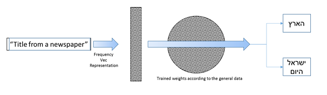

# Newspaper title classifier
This classifier was developped as part of the hackathon of IML (introduction to machine learning) course in hebrew university. 
The hackathon took place at 2017. We built a classifier that identifies if a given newspaper's article's title is
belonging to "Haaretz" or "Israel-Hayom", which are two famous newspapers published in Israel in Hebrew.

## Theory
We used a bag_of_words representations with some additional features such as length of the sentence, 
avg length of the words, etc.
Following is the archeticture of the final solution:


## Usage
You can use the classifier API class directly, i.e. initialize an object that 
recieves a list of m unclassified headlines, and predicts for each one which
newspaper published it. The first argument is a list of length m containing the
headlines' texts (strings), and it returns the a binary vector of length m (for
the two newspaper accordingly).

## Running example
```python
#!/usr/bin/python3
from classifier import Classifier
c = Classifier()
titles = ['Example of a title, which is written here.', 'Another short title']
outcome = c.classify(titles)
print(', '.join([str(e) for e in outcome]))
```


# License:
Licensed under the Apache License, Version 2.0 (the "License");
 you may not use this file except in compliance with the License. 
 You may obtain a copy of the License at
     http://www.apache.org/licenses/LICENSE-2.0
 Unless required by applicable law or agreed to in writing, software
 distributed under the License is distributed on an "AS IS" BASIS,
 WITHOUT WARRANTIES OR CONDITIONS OF ANY KIND, either express or implied.
 See the License for the specific language governing permissions and
 limitations under the License.
  

# Contributions
If you want to contribute you are more than welcome. These are the possible contibutions we'll appreciate:
- To donate money, please contact sharpblade4@gmail.com
- To suggest new features, or other modules but the title classification
  please contact the repo owener, open a descriptive issue.
- If you found a bug, please report it. You may also fix it :-) thanks! 
  For any help\guidance contact: ron.urbach@mail.huji.ac.il .
- To add new modules, please make sure you follow the Request\Response API.
